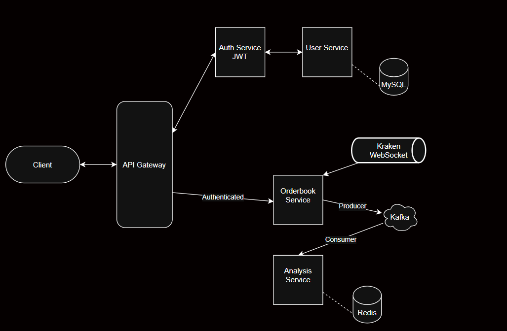
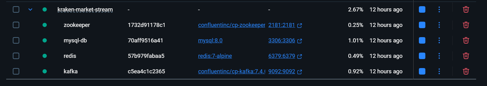
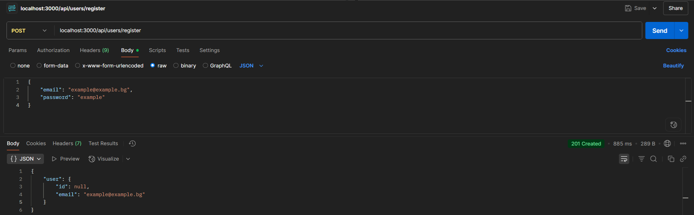
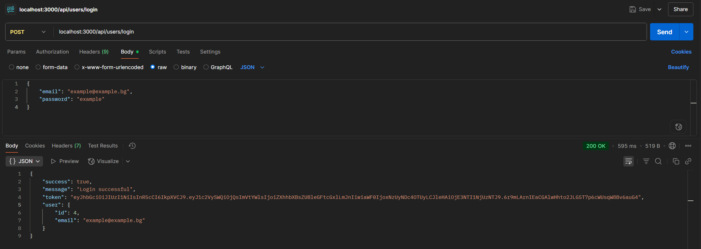
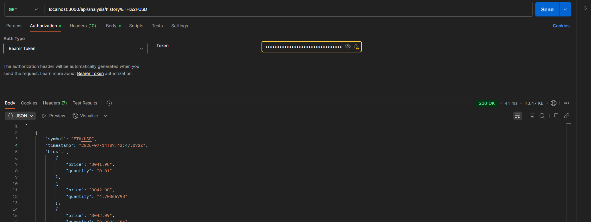
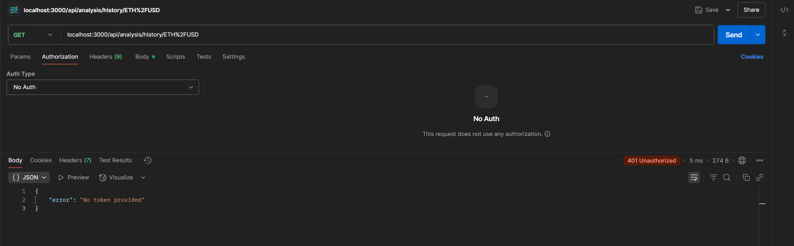

# kraken-market-stream

The Kraken Market Stream is a platform where users can register and subscribe to real-time cryptocurrency trading data. Upon login, they can track and perform analysis on give crypto pairs. 

## System Design 

The design is currently comprised of 5 microservices - User service, Orderbook service, Authentication service, Analysis service and an API Gateway.



## Microservices 

#### User Microservice 
Handles user registration and authentication. This service manages user accounts, stores user credentials securely using bcrypt for password hashing, and provides endpoints for user registration and login. It connects to the MySQL database to persist user data and validates user credentials during the login process.

#### Auth Microservice
Responsible for JWT token generation and verification. This stateless service creates and validates JSON Web Tokens for authenticated sessions. It provides endpoints to generate tokens after successful login and verify token validity for protected routes across the system.

#### Orderbook Microservice
Connects to Kraken's WebSocket API to receive real-time cryptocurrency orderbook data. This service processes live market data updates, maintains the current orderbook state, and publishes snapshots to Kafka every second. It handles orderbook snapshots and updates for trading pairs like ETH/USD, calculating bid-ask spreads and mid-prices.

#### Analysis Microservice
Consumes orderbook snapshots from Kafka and stores them in Redis for analysis. This service provides REST endpoints to retrieve the latest snapshot data and historical orderbook information for any cryptocurrency pair. It maintains up to 10,000 historical snapshots per trading pair for trend analysis and market research.

#### API Gateway
Acts as the single entry point for all client requests, routing them to appropriate microservices. This service handles authentication middleware, forwards requests to user, orderbook, and analysis services, and manages cross-service communication. It includes request logging and token validation for protected endpoints.

## How to Setup

The setup is a two-step process: 

1. Run Docker containers from the root folder:

```
docker-compose up -d
```

<details>
    <summary>Why is Docker needed?</summary>
    The containers are needed for setting up MySQL, Redis and Kafka. All of the services run on their default ports (if you decide to run the app with local setups), namely: 

    - Zookeeper - `2181:2181`
    - Kafka Brokers - `9092:9092`
    - Redis - `6379:6379`
    - MySQL - `3306:3306`
</details>

After running the command, the container with each respective image should be running as follows:



1. Setup, build and run all of the Node.js services:

```
npm run setup:all
```

This command goes in each microservice folder, runs:

```
npm install && npm run build && npm run start
```

Congrats! The application is up and running!

## How to Run 

After ensuring the docker and services are running: 

1. Create a user account by sending a POST request (with email and password) to:

```
localhost:3000/api/users/register
```



2. Use the same credentials and perform a POST request to login:

```
localhost:3000/api/users/login
```



It will return a token. Save it. 

3. Perform a GET history data fetch with the bearer token:

```
localhost:3000/api/analysis/history/ETH%2FUSD
```



If you do not provide the token, the service will result in:

